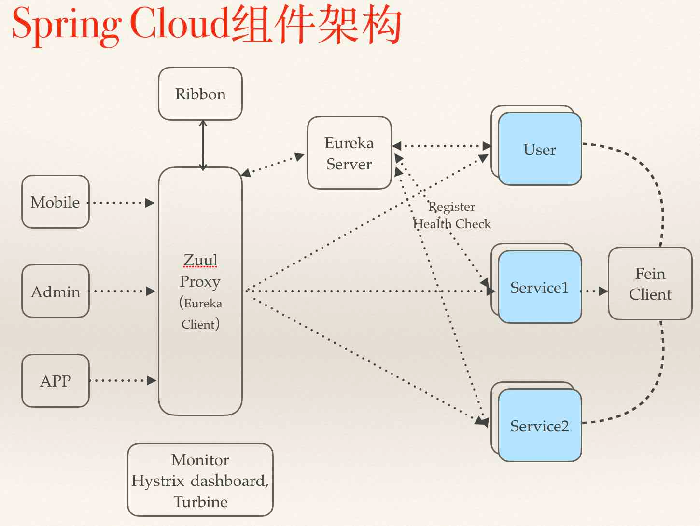

**该项目是我在学习 spring-cloud时的练习项目**
参考spring-cloud教程[史上最简单的 SpringCloud 教程 | 终章](http://blog.csdn.net/forezp/article/details/70148833 "史上最简单的 SpringCloud 教程 | 终章").

# 项目目录
- eurekaserver  服务注册中心(EurekaServer)
- eurekaclient01    服务提供者(EurekaClient)
- eurekaclient02    服务提供者(EurekaClient)，项目内容与eurekaclient01一致，唯一不同是配置文件中的 `server.port`，主要是为了方便启动模拟服务提供者多实例的情况。
- serviceribbon 服务消费者(rest+ribbon)
- servicefeign  使用feign(基于ribbon, eureka)的服务消费者
- servicezuul   路由服务
- configserver  spring-cloud配置中心(使用git仓库存储配置信息-自带版本控制能力，.yml配置文件不允许使用`\t`)
- configclient  spring-cloud读取配置中心DEMO(可集成到其他spring-cloud服务)
- servicezipkin 收集分布式系统之间的调用关系，实现服务依赖链路追踪
- serviceturbine    Hystrix Turbine将每个服务Hystrix Dashboard数据进行了整合

# spring cloud 架构

> 架构分析：
- 1、请求统一通过API网关（Zuul）来访问内部服务.
- 2、网关接收到请求后，从注册中心（Eureka）获取可用服务
- 3、由Ribbon进行均衡负载后，分发到后端具体实例
- 4、微服务之间通过Feign进行通信处理业务
- 5、Hystrix负责处理服务超时熔断
- 6、Turbine监控服务间的调用和熔断相关指标

# spring cloud 相关工具
1、Spring Cloud Config 配置中心，利用git集中管理程序的配置。
2、Spring Cloud Netflix 集成众多Netflix的开源软件
3、Spring Cloud Bus 消息总线，利用分布式消息将服务和服务实例连接在一起，用于在一个集群中传播状态的变化
4、Spring Cloud for Cloud Foundry 利用Pivotal Cloudfoundry集成你的应用程序
5、Spring Cloud Cloud Foundry Service Broker 为建立管理云托管服务的服务代理提供了一个起点。
6、Spring Cloud Cluster 基于Zookeeper, Redis, Hazelcast, Consul实现的领导选举和平民状态模式的抽象和实现。
7、Spring Cloud Consul 基于Hashicorp Consul实现的服务发现和配置管理。
8、Spring Cloud Security 在Zuul代理中为OAuth2 rest客户端和认证头转发提供负载均衡
9、Spring Cloud Sleuth SpringCloud应用的分布式追踪系统，和Zipkin，HTrace，ELK兼容。
10、Spring Cloud Data Flow 一个云本地程序和操作模型，组成数据微服务在一个结构化的平台上。
11、Spring Cloud Stream 基于Redis,Rabbit,Kafka实现的消息微服务，简单声明模型用以在Spring Cloud应用中收发消息。
12、Spring Cloud Stream App Starters 基于Spring Boot为外部系统提供spring的集成
13、Spring Cloud Task 短生命周期的微服务，为SpringBooot应用简单声明添加功能和非功能特性。
14、Spring Cloud Task App Starters
15、Spring Cloud Zookeeper 服务发现和配置管理基于Apache Zookeeper。
16、Spring Cloud for Amazon Web Services 快速和亚马逊网络服务集成。
17、Spring Cloud Connectors 便于PaaS应用在各种平台上连接到后端像数据库和消息经纪服务。
18、Spring Cloud Starters （项目已经终止并且在Angel.SR2后的版本和其他项目合并）
19、Spring Cloud CLI 插件用Groovy快速的创建Spring Cloud组件应用。
